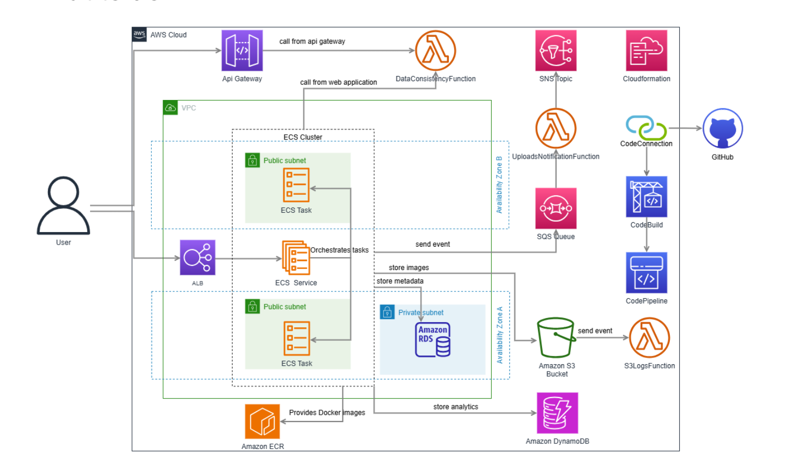

# ☁️ AWS Serverless Image Upload & Analytics Platform (Java Spring Boot)


---
## 🏗 High-Level Architecture

<p align="center">
  
</p>

## 📌 Overview

A production-grade, AWS-native backend built with **Java 17** and **Spring Boot 3.x**, containerized with **Docker**, and deployed on **Amazon ECS Fargate**.

It delivers **secure image uploads**, **asynchronous processing** with **SQS + Lambda**, **real-time notifications** via **SNS**, and **analytics** stored in **DynamoDB**, while image metadata lives in **RDS (MySQL)**.

**Why this project matters (for recruiters & hiring managers):**
- Demonstrates **cloud-native, microservices-style architecture**
- Showcases **enterprise Spring Boot** patterns
- End-to-end AWS: **networking, security, messaging, databases, CI/CD, IaC**

---

## ☁️ AWS Stack Used

This system leverages multiple managed AWS services—each chosen for a specific role.

| Service | Purpose |
|---|---|
| **Amazon ECS (Fargate)** | Runs the Spring Boot API in a serverless container runtime |
| **Amazon ECR** | Stores Docker images for ECS |
| **Amazon S3** | Object storage for uploaded images |
| **Amazon SQS** | Decouples and buffers upload events |
| **AWS Lambda** | Consumes SQS messages, triggers notifications & updates analytics |
| **Amazon SNS** | Publishes notifications to subscribers (email/SMS/etc.) |
| **Amazon RDS (MySQL)** | Relational store for image metadata |
| **Amazon DynamoDB** | NoSQL store for view/download counters & timestamps |
| **Amazon CloudWatch** | Centralized logs, metrics, and alarms |
| **AWS CloudFormation** | Infrastructure as Code for repeatable environments |
| **AWS IAM** | Role-based access control (least privilege) |
| **Amazon VPC** | Public/private subnets & security groups for isolation |
| **(Optional) Amazon EventBridge** | Scheduling / event routing extensions |

---


**Flow Summary**
1. **Client → ALB → ECS (Spring Boot API)** receives `POST /api/upload`.
2. API stores image in **S3** and persists metadata in **RDS**.
3. API emits an event to **SQS** (decoupled).
4. **Lambda** (SQS trigger) processes the message:
   - Increments counters in **DynamoDB** (views/downloads).
   - Publishes a notification to **SNS**.
5. **CloudWatch** captures logs & metrics across the stack.

---

## 🚀 Features

- **Java 17 + Spring Boot 3.x** REST API
- **Hybrid database design** → RDS (metadata) + DynamoDB (analytics)
- **Event-driven** with SQS + Lambda + SNS
- **Containerized** and **auto-scaling** on ECS Fargate
- **IaC with CloudFormation** (repeatable, reviewable infra)
- **Private networking** for RDS; public ALB for API
- **Observability** via CloudWatch logs & metrics
- **Security**: IAM least privilege, security groups, parameterized secrets

---

## ⚙️ Tech Stack

**Languages & Frameworks**
- Java 17, Spring Boot 3.x (Web, Data JPA, Actuator), Lombok

**Cloud & Infra**
- ECS Fargate, ECR, S3, SQS, Lambda, SNS, RDS (MySQL), DynamoDB, CloudWatch, IAM, VPC, CloudFormation

**DevOps & Tooling**
- Docker, AWS CLI, SAM CLI (for Lambda packaging), CodeBuild/CodePipeline (CI/CD-ready)

---

## 📡 API Endpoints (Spring Boot)

| Method | Endpoint | Description |
|---|---|---|
| `POST` | `/api/upload` | Upload an image (stores in S3, persists metadata to RDS, pushes event to SQS) |
| `GET` | `/api/images` | List uploaded images (RDS) |
| `GET` | `/api/analytics/{imageName}` | Get analytics (views/downloads) from DynamoDB |
| `GET` | `/actuator/health` | Liveness/Readiness for ECS/ALB health checks |


**Example upload**
```bash
curl -X POST \
  -F "file=@/path/to/image.jpg" \
  https://<ALB-DNS>:8080/api/upload
